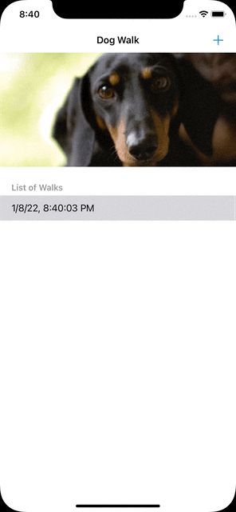

# BGDogWalk
App for Customise Core Data Stack Demo

# CoreData Stack code
```
import Foundation
import CoreData

class CoreDataStack {

    private let modelName: String

    init(modelName: String) {
        self.modelName = modelName
    }

    private lazy var storeContainer: NSPersistentContainer = {
        let container = NSPersistentContainer(name: self.modelName)
        container.loadPersistentStores { (storeDescription, error) in
            if let error = error as NSError? {
                print("Unresolved Error \(error), \(error.userInfo)")
            }
        }
        return container
    }()

    lazy var managedContext: NSManagedObjectContext = {
        return self.storeContainer.viewContext
    }()

    func saveContext () {
        guard managedContext.hasChanges else { return }
        do {
            try managedContext.save()
        } catch {
            print(error.localizedDescription)
        }
    }
}

```

## App Preview

<kbd>
 
</kbd>
